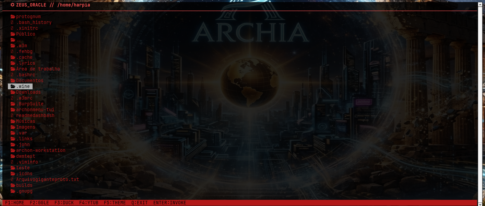
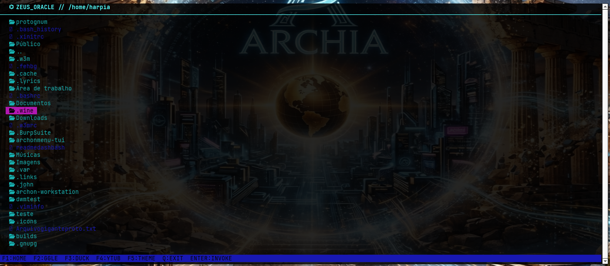
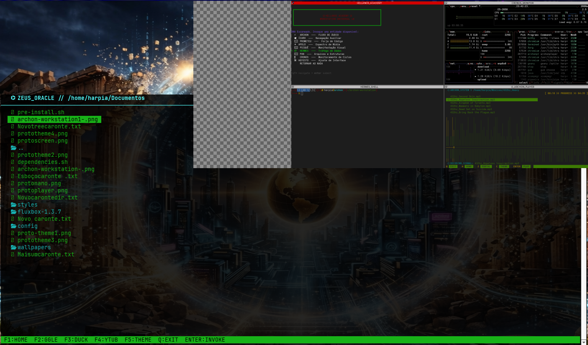
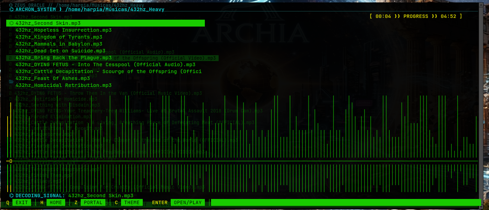

# ⌬ ZEUS-BROWSER // O Observador do Olimpo
<p align="center">
  
</p>

> Navegador tático do ecossistema mitológico Archon. Desenvolvido para alto desempenho com integração nativa ao visualizador feh e suporte a áudio digital. Comande a web e monitore os dados da rede diretamente do topo do Olimpo.

### ⌬ Interface em Operação (Matrizes de Cores)

<p align="center">
  
  
  
</p>

---
## ⚔️ O Arsenal Tecnológico

> O **ZeusBrowser TUI** é a central de comando web definitiva do ecossistema Archon. Forjado puramente em **Linguagem C** para terminais de alta performance, ele traz integração nativa ao visualizador `feh` e processamento otimizado de áudio digital. Governe a web e monitore os fluxos de dados diretamente do topo do Olimpo.

### 🛠️ Arquitetura e Dependências

O projeto utiliza a biblioteca `ncurses` para renderização gráfica no terminal e ferramentas nativas para manipulação de mídia e texto.

* **Linguagem:** C (GCC / Make)
* **Interface:** `ncurses`
* **Editor Integrado:** `nano`
* **Gráficos:** `feh`
* **Áudio:** `alsa-utils`


---

*   👁️ **Visão de Águia (Engine Feh):** Delegamento instantâneo de renderização visual para o visualizador de imagens `feh`.
*   🔊 **Frequência Divina:** Camada integrada de áudio via drivers ALSA para manipulação de streams digitais.
*   ⚡ **Performance Militar:** Construído puramente em C com suporte completo a Unicode para exibição de glifos e ícones complexos.

---

## 🛠️ Arquitetura de Instalação

Para invocar este utilitário no seu arsenal Arch Linux através do gerenciador de pacotes nativo, execute o protocolo de build estruturado:

### 1. Dependências do Sistema
Antes da forja, certifique-se de que os pacotes de runtime e renderização estão presentes no sistema de arquivos:
```bash
sudo pacman -S ncurses feh alsa-utils git make gcc
```

### 2. Clonagem e Compilação do Pacote
```bash
# Clone o repositório do Olimpo
git clone https://github.com/zeusbrowser.git
cd zeusbrowser

# Dispare a forja limpa do pacote local
makepkg -si
```

---

## 🎹 Matriz de Comandos (Keybindings)

A interface responde instantaneamente aos seguintes gatilhos operacionais mapeados na barra de status:


| Atalho | Comando / Motor | Função no Olimpo |
| :--- | :--- | :--- |
| <kbd>F1</kbd> | `HOME` | Retorna o foco para a matriz central do sistema |
| <kbd>F2</kbd> | `GGLE` (Google) | Dispara busca rápida no motor Google |
| <kbd>F3</kbd> | `DUCK` (DuckDuckGo) | Consulta tática focada em privacidade via DuckDuckGo |
| <kbd>F4</kbd> | `YTUB` (YouTube) | Invoca a busca de streams de vídeo/áudio no YouTube |
| <kbd>F5</kbd> | `THEME` | Alterna instantaneamente a paleta de cores (Matrizes) |
| <kbd>ENTER</kbd> | `INVOKE` | Executa e renderiza a URL ou termo selecionado |
| <kbd>Q</kbd> | `EXIT` | Aborta o processo imediatamente, limpando a memória |


---
## 📂 Organização da Matéria-Prima

```text
zeusbrowser/
├── zeusbrowser-tui/
│   ├── assets/       # Temas visuais e identidades cromáticas (.png)
│   ├── include/      # Cabeçalhos estruturais (zeus.h)
│   ├── src/          # Código-fonte puro em C (main.c)
│   ├── Makefile      # Instruções de compilação da forja
│   └── install.sh    # Script utilitário auxiliar
└── PKGBUILD          # Script de empacotamento oficial do Arch Linux
```

---

<p align="center">
  
</p>

