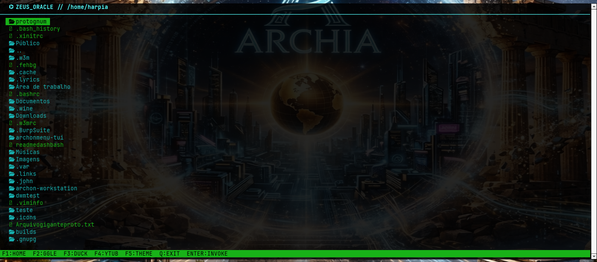

# ⌬ ZEUS-BROWSER // O Observador do Olimpo


<p align="center">
  
</p>

> Navegador tático do ecossistema mitológico Archon. Desenvolvido para alto desempenho com integração nativa ao visualizador feh e suporte a áudio digital. Comande a web e monitore os dados da rede diretamente do topo do Olimpo.


> Navegador tático do ecossistema mitológico Archon. Desenvolvido para alto desempenho com integração nativa ao visualizador feh e suporte a áudio digital. Comande a web e monitore os dados da rede diretamente do topo do Olimpo.

---

## ⚔️ O Arsenal Tecnológico

O **ZEUS-BROWSER** rejeita o inchaço dos navegadores comerciais modernos. Ele opera como uma sentinela ultraleve na sua interface de terminal, integrando manipulação gráfica externa e fluxo de som digital de forma cirúrgica.

*   👁️ **Visão de Águia (Engine Feh):** Delegamento instantâneo de renderização visual para o visualizador de imagens `feh`.
*   🔊 **Frequência Divina:** Camada integrada de áudio via drivers ALSA para manipulação de streams digitais.
*   ⚡ **Performance Militar:** Construído puramente em C com suporte completo a Unicode para exibição de glifos e ícones complexos.

---

## 🛠️ Arquitetura de Instalação

Para invocar este utilitário no seu arsenal Arch Linux através do gerenciador de pacotes nativo, execute o protocolo de build estruturado:

### 1. Dependências do Sistema
Antes da forja, certifique-se de que os pacotes de runtime e renderização estão presentes no sistema de arquivos:
```bash
sudo pacman -S ncurses feh alsa-utils git make gcc
```

### 2. Clonagem e Compilação do Pacote
```bash
# Clone o repositório do Olimpo
git clone https://github.com/zeusbrowser.git
cd zeusbrowser

# Dispare a forja limpa do pacote local
makepkg -si
```

---

## 🎹 Matriz de Comandos (Keybindings)

A interface responde instantaneamente aos seguintes gatilhos operacionais mapeados no terminal:


| Atalho | Ação Executada | Função no Olimpo |
| :--- | :--- | :--- |
| <kbd>F1</kbd> | `HOME` | Retorna o foco para a matriz central do sistema |
| <kbd>F2</kbd> | `TOGGLE IMAGE` | Dispara o dump e renderização gráfica via `feh` |
| <kbd>F5</kbd> | `CHANGE THEME` | Alterna instantaneamente a paleta de cores (Visual/Cyber) |
| <kbd>Q</kbd> | `EXIT` | Aborta o processo imediatamente, limpando a memória |

---

## 📂 Organização da Matéria-Prima

```text
zeusbrowser/
├── zeusbrowser-tui/
│   ├── assets/       # Temas visuais e identidades cromáticas (.png)
│   ├── include/      # Cabeçalhos estruturais (zeus.h)
│   ├── src/          # Código-fonte puro em C (main.c)
│   ├── Makefile      # Instruções de compilação da forja
│   └── install.sh    # Script utilitário auxiliar
└── PKGBUILD          # Script de empacotamento oficial do Arch Linux
```

---
<p align="center">
  
</p>
